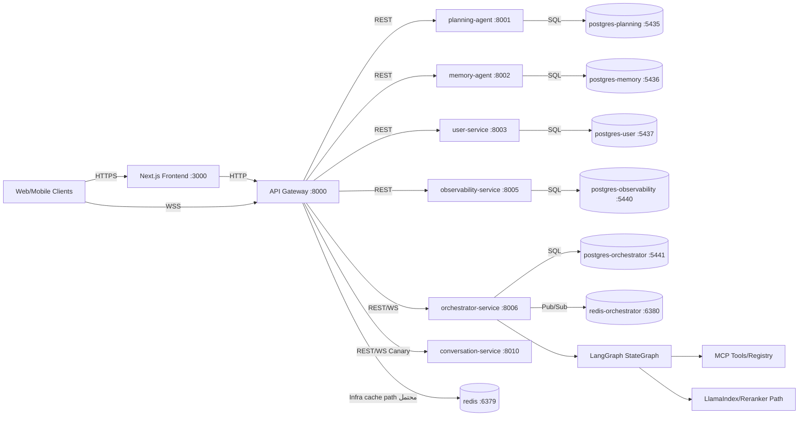
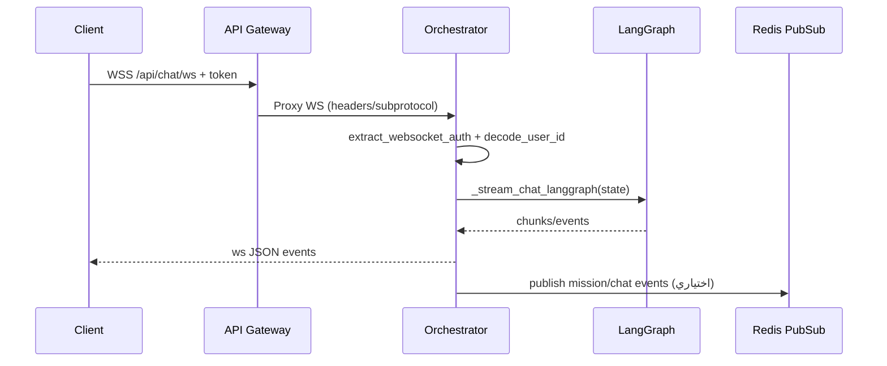
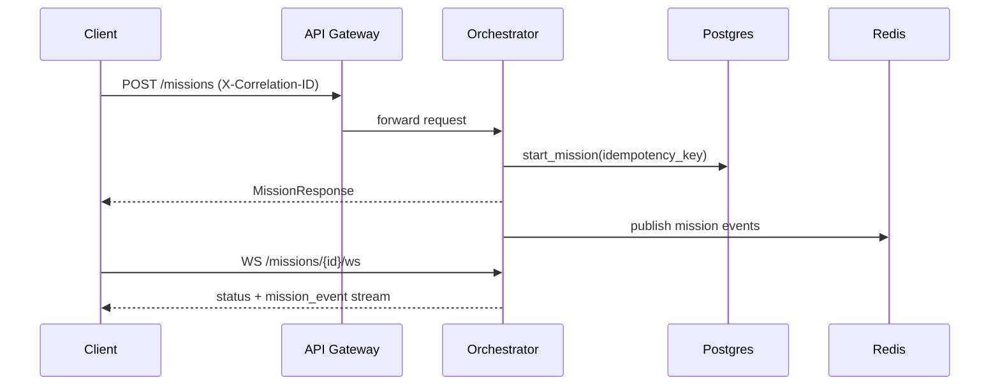
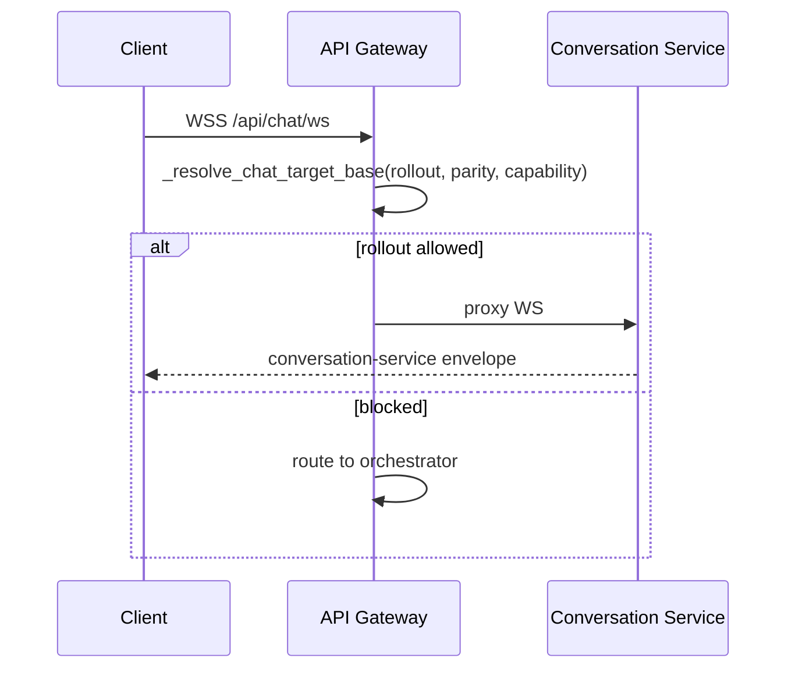
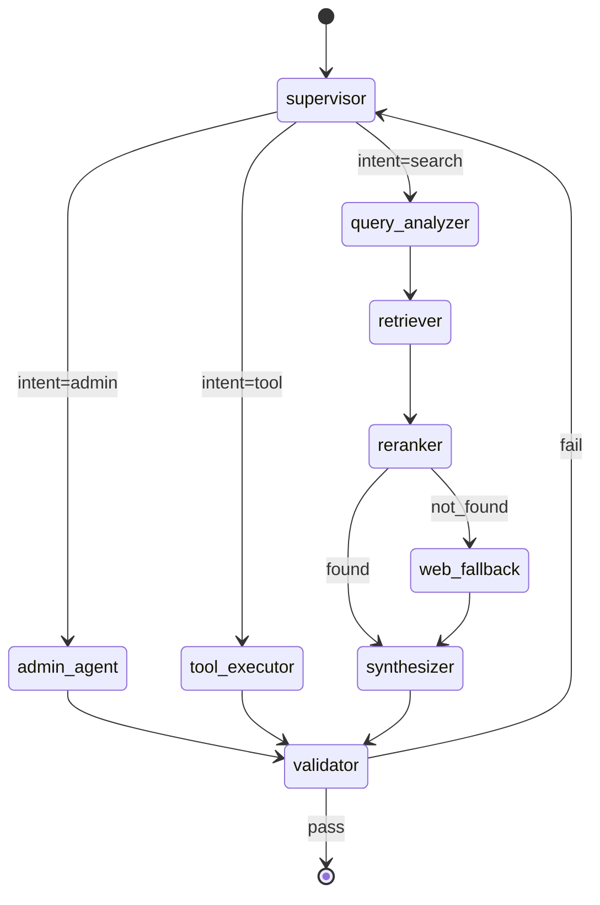

# التقرير التشخيصي الجراحي العميق لمشروع CogniForge (API-First Microservices)

> **نطاق التقرير:** تشخيص معماري/أمني/أدائي/تشغيلي مبني على أدلة من المستودع الحالي فقط، مع خطة علاج قابلة للتنفيذ.
> **مهم:** لا توجد بيانات إنتاج (Logs/Traces حقيقية 24–72 ساعة) مرفقة في هذا المستودع، لذلك تم وسم أي قيمة تشغيلية مباشرة بـ **غير متاح** مع طريقة التحصيل.

---

## [قسم] الملخص التنفيذي

| المشكلة | الدليل | الأثر | الإصلاح المقترح | الأولوية | التحقق |
|---|---|---|---|---|---|
| بوابة API تقبل CORS واسعًا افتراضيًا | `BACKEND_CORS_ORIGINS=["*"]` و`ALLOWED_HOSTS=["*"]` افتراضيًا | سطح هجوم أعلى في البيئات غير المضبوطة | فرض allowlist عبر env وإسقاط `*` خارج dev + اختبار سياسات CORS | P0 | `pytest tests/microservices/test_gateway_security_settings.py -q` |
| سر JWT افتراضي صريح في الإعدادات | `SECRET_KEY="super_secret_key_change_in_production"` | مخاطر تزوير توكنات إذا ساءت إدارة env | دوران مفاتيح + منع الإقلاع إذا لم يُستبدل المفتاح (موجود جزئيًا لproduction/staging) | P0 | فحص startup في staging + secret scanning |
| قناة WS في Conversation Service بدون توثيق/تفويض | `websocket.accept(...)` مباشر دون JWT validation | اشتراك/إرسال غير مصرح عند تفعيل cutover أو bypass | توحيد مصادقة WS في gateway/orchestrator + رفض الاتصال بلا token + rate/message limits | P0 | k6 WS auth scenarios + security tests |
| Event Bus يعتمد Redis Pub/Sub فقط (at-most-once) | `publish/subscribe` عبر `redis.publish` و`pubsub.listen` بدون persistence | فقدان أحداث mission عند انقطاع المستهلك/الخدمة | اعتماد Outbox + Redis Streams/XREADGROUP للمسارات الحرجة | P1 | اختبار انقطاع/استئناف مستهلك وتحقق replay |
| فجوة وثائق/تشغيل: تضارب منافذ orchestrator بين docs وcompose | README يذكر 8004 بينما compose يربطه 8006 | أخطاء توجيه/تجهيز بيئات/مراقبة | توحيد truth source للمنافذ + فحص آلي drift في CI | P1 | Script guardrail يقارن docs/contracts/compose |
| observability موجودة جزئيًا لكن بدون SLO موحد للخدمات الحالية | ملفات OTel/Prometheus موجودة لكن SLO file يرتكز على `cogniforge-classifier` | إنذارات غير مرتبطة بالمسارات الحرجة الفعلية | تعريف RED/USE لكل خدمة microservice + لوحات موحدة + alert rules على chat/ws/mission | P1 | promtool check rules + dashboards smoke |

### KPI Snapshot (حالي/هدف)

| KPI | الحالي | الهدف 30 يوم |
|---|---:|---:|
| API p95 latency | غير متاح | < 300ms |
| API p99 latency | غير متاح | < 600ms |
| 5xx error rate | غير متاح | < 1% |
| WS disconnect rate | غير متاح | < 2% |
| DB lock wait p95 | غير متاح | < 100ms |
| Cache hit ratio | غير متاح | > 85% |
| Agent success rate | غير متاح | > 95% |
| Cost/token | غير متاح | -20% من baseline |
| Retrieval precision@k | غير متاح | > 0.75 |

---

## [قسم] افتراضات وأسئلة حاسمة

| نقطة غامضة | لماذا مهمة | كيف نتحقق | الافتراض المؤقت |
|---|---|---|---|
| هل Supabase فعّال فعليًا أم مجرد تكامل اختياري؟ | يؤثر على RLS وRealtime/Auth بالكامل | `rg -n "SUPABASE|supabase" app microservices config` + env manifests | التكامل موجود جزئيًا وليس مسارًا تشغيليًا موحدًا |
| أين نقطة إنهاء WS في الإنتاج (Gateway فقط أم direct service exposure)؟ | يحدد enforcement لمصادقة/Origin/Rate limit | فحص ingress/kong/istio + `k8s gateway` routes | Gateway هو المسار الافتراضي، لكن bypass محتمل |
| هل تم تفعيل Conversation cutover في prod؟ | لأن conversation WS حاليًا بلا auth واضح | فحص env: `ROUTE_CHAT_WS_CONVERSATION_ROLLOUT_PERCENT` و`CONVERSATION_PARITY_VERIFIED` | مفترض 0 افتراضيًا |
| ما تعريف TLM في هذا المشروع؟ | يؤثر على gate قبل تنفيذ الأدوات | فحص docs + `rg -n "TLM|trust"` | موجود Mock TLM في admin graph فقط |
| هل توجد سياسات RLS فعلية في DB المستهدفة؟ | محور الأمن الدقيق للبيانات | SQL: `select * from pg_policies where schemaname in ('public','realtime');` | غير متاح داخل المستودع |
| ما خط الأساس للأداء الحالي؟ | لتقييم أثر أي إصلاح | تشغيل k6/Locust وجمع Prometheus + traces 72h | غير متاح |

---

## [قسم] صورة المعمارية وحدود الخدمات



> **ملاحظة:** sticky sessions غير مثبتة في manifests المقروءة؛ يلزم توثيق صريح إذا كانت WS تمر عبر LB متعدد النسخ.

### Service Inventory

| service | repo path | لغة | runtime | ports | dependencies | DB schema | SLIs مبدئية |
|---|---|---|---|---|---|---|---|
| frontend | `frontend/` | JS/React | Node | 3000 | api-gateway | - | p95 page/api proxy |
| api-gateway | `microservices/api_gateway` | Python | FastAPI/Uvicorn | 8000 | all backend services | - | 5xx, p95, ws_open, cb_open |
| planning-agent | `microservices/planning_agent` | Python | FastAPI | 8001 | postgres-planning | planning | availability, p95 |
| memory-agent | `microservices/memory_agent` | Python | FastAPI | 8002 | postgres-memory | memory | retrieval latency |
| user-service | `microservices/user_service` | Python | FastAPI | 8003 | postgres-user | users/auth | auth success/fail |
| orchestrator-service | `microservices/orchestrator_service` | Python | FastAPI+LangGraph | 8006 | postgres-orchestrator, redis-orchestrator | orchestrator | mission latency, ws disconnect |
| observability-service | `microservices/observability_service` | Python | FastAPI | 8005 | postgres-observability | observability | ingest lag |
| conversation-service | `microservices/conversation_service` | Python | FastAPI | 8010 | none | - | ws auth failures |

---

## [قسم] تدفقات البيانات الحرجة

### التدفق 1: Customer Chat عبر WS + StateGraph



**Failure modes:**
- token غائب/خاطئ → close(4401) (جيد)
- غياب limits على message size/rate في gateway/orchestrator → خطر abuse
- انقطاع upstream WS في proxy → close 1011 بدون retry handshake strategy

**Timeout/Retry/Backpressure:**
- إضافة مهلة `receive_json` + حد payload + queue depth
- اعتماد ping/pong + heartbeat timeout
- throttling per user/IP + concurrent WS caps

### التدفق 2: Launch Mission + Idempotency + Events



**Failure modes:**
- عدم وجود retry policy واضحة لأخطاء serialization بقاعدة البيانات
- Pub/Sub بدون durability => احتمال فقد event عند restart

### التدفق 3: Canary Cutover إلى Conversation Service



**Failure mode حرج:** Conversation WS يقبل الاتصال بلا تحقق JWT.

---

## [قسم] تشخيص الأمن

### Threat Model عملي (OWASP API Top 10 مختصر)

| finding | exploit narrative | affected components | fix | test | priority |
|---|---|---|---|---|---|
| Broken Auth على WS parity path | مهاجم يفتح WS مباشر على conversation دون token | conversation-service, gateway cutover | فرض JWT verification داخل conversation أو إغلاق التعرض المباشر | WS negative auth tests | P0 |
| Security Misconfiguration | `*` في CORS/hosts افتراضيًا | api-gateway | قفل origins/hosts per env + startup hard fail | env config tests | P0 |
| Broken Object/AuthZ | `decode_user_id` فقط من `sub` int دون claims إضافية | orchestrator WS/admin | توسيع claims: role/scope/aud/iss + RBAC checks | authZ integration tests | P1 |
| Injection/Unsafe forwarding | gateway forwards معظم headers للـupstream | api-gateway websocket proxy | header allowlist صارم للـWS upgrade | proxy security tests | P1 |
| Excessive resource consumption | لا limits واضحة للرسائل WS | gateway/orchestrator/conversation | message size + rate + connection caps | k6 WS abuse profile | P1 |

### Supabase
- **غير متاح:** سياسات RLS، realtime auth policy، hardening لـData API غير موجودة كملفات SQL/infra صريحة داخل المستودع الحالي.
- **إجراء تحقق مطلوب:** تشغيل استعلام `pg_policies` على البيئة الفعلية واستخراج سياسات `realtime.messages`.

### Snippets إصلاحية (جاهزة للتطبيق)

```python
# gateway ws guard (تصوري):
# - تحقق origin allowlist
# - reject oversized frames
# - token required before accept
ALLOWED_WS_ORIGINS = {"https://app.example.com"}
if websocket.headers.get("origin") not in ALLOWED_WS_ORIGINS:
    await websocket.close(code=4403)
    return
```

```yaml
# rate limit policy (gateway/ingress)
ws_limits:
  max_connections_per_ip: 20
  max_messages_per_minute: 300
  max_message_size_bytes: 32768
```

---

## [قسم] تشخيص الأداء والتوسع

### REST + WS
- يوجد pooling/timeouts/retries في `GatewayProxy`، وهذا جيد كبداية.
- retry مقيد للـGET/HEAD/OPTIONS فقط (جيد لتجنب تكرار writes) لكن لا يوجد budget ديناميكي حسب endpoint.
- WS proxy لا يطبق backpressure policy صريحة (queue bounds/slow consumer handling).

### Redis
- المسار الحالي للأحداث في orchestrator هو Pub/Sub (خفيف وسريع لكنه غير durable).
- للمسارات الحرجة (mission events) يوصى بـ **Outbox + Redis Streams**:
  - `XADD mission_events * ...`
  - `XREADGROUP GROUP mission_consumers ... BLOCK 5000`
  - إعادة معالجة الرسائل pending عند restart.

### PostgreSQL
- عزل المعاملات ومستوى retry لـserialization failures غير موثق/مفعل بوضوح في المسارات الحرجة.
- توجد مؤشرات تصميم جيدة (idempotency_key unique + outbox model) لكنها تحتاج policy تشغيلية موحدة.

### جدول قياس (Baseline)

| endpoint/operation | p95/p99 | throughput | CPU/mem | DB time | cache hit | notes |
|---|---|---|---|---|---|---|
| GET /health (gateway) | غير متاح | غير متاح | غير متاح | غير متاح | - | يحتاج scrape فعلي |
| POST /missions | غير متاح | غير متاح | غير متاح | غير متاح | غير متاح | idempotency header موجود |
| WS /api/chat/ws | غير متاح | غير متاح | غير متاح | غير متاح | - | absence of WS SLI حاليا |

### سكربت benchmark قابل للتكرار

```bash
#!/usr/bin/env bash
set -euo pipefail
BASE_URL="${BASE_URL:-http://localhost:8000}"

# REST smoke load
k6 run tests/performance/load-test.js -e BASE_URL="$BASE_URL"

# WS load placeholder (اكتب سيناريو k6/ws مخصص):
# k6 run tests/performance/ws-chat-load.js -e BASE_URL="$BASE_URL"
```

---

## [قسم] الاتساق والمعاملات والتزامن

### Invariants
1. كل `mission` يجب أن تمتلك معرفًا فريدًا وحالة متسقة.
2. نفس `idempotency_key` لا ينشئ mission جديدة.
3. كل حدث mission مهم إما يصل للمستهلك أو يبقى قابلاً لإعادة المعالجة (durability invariant).

### حدود المعاملة
- إنشاء mission + كتابة outbox/event يجب أن يكونا داخل معاملة واحدة (atomic boundary).
- نشر Redis الخارجي يتم بعد commit مع إمكانية retry idempotent.

### SQL/سياسات مقترحة

```sql
-- enforce idempotency surface (if not already migrated everywhere)
create unique index if not exists uq_mission_idempotency_key
  on missions (idempotency_key)
  where idempotency_key is not null;
```

```python
# serialization-retry skeleton
for attempt in range(5):
    try:
        async with session.begin():
            # write mission + outbox atomically
            ...
        break
    except Exception as exc:
        if "could not serialize access" in str(exc).lower() and attempt < 4:
            await asyncio.sleep(0.05 * (2 ** attempt))
            continue
        raise
```

### اختبارات concurrency المطلوبة
- نفس `X-Correlation-ID` في طلبين متوازيين => نفس mission id.
- restart خلال بث الأحداث => لا فقد للأحداث الحرجة (عند الانتقال إلى streams/outbox الكامل).

---

## [قسم] تشخيص طبقة Agents وOrchestration

### LangGraph StateGraph الفعلي (مستخرج من الكود)



**تشخيص:**
- يوجد fallback آمن عند غياب تبعيات البحث (`_load_search_nodes` يرجع Passthrough).
- يوجد loop محتمل `validator -> supervisor` بدون guard عدّاد محاولات واضح.
- توجد `MockTLM` في admin graph (ثقة ثابتة 0.95)؛ هذا ليس trust gate حقيقيًا.

### LlamaIndex/Reranker
- المسار موجود مفهوميًا عبر `retriever -> reranker -> synthesizer` داخل graph.
- يلزم قياس retrieval quality (precision@k / nDCG) وربطها بقرار web fallback.

### DSPy
- مستخدم داخل `SupervisorNode` (`ChainOfThought`) لتصنيف intent.
- التحسين المطلوب: eval harness منفصل لقياس false positives/false negatives للتصنيف الإداري.

### MCP/KAgent
- توجد اختبارات وخدمات MCP/KAgent في الشجرة، لكن policy صلاحيات تشغيلية (allowlist per tool, env separation) غير موثقة بما يكفي.

### جدول الوكلاء

| agent | responsibilities | tools | guardrails | eval metrics | fallback paths |
|---|---|---|---|---|---|
| supervisor | intent routing | dspy classifier | emergency deterministic guard | intent accuracy | default search |
| admin_agent | admin query execution | registry admin.* | tool-name validator | tool success rate | error envelope |
| retriever/reranker | استرجاع وترتيب | internal/web | validator pass/fail | precision@k, latency | web_fallback |
| tool_executor | تنفيذ أداة مباشرة | ADMIN_TOOLS | contract check + error mapping | execution latency | validator response |

---

## [قسم] الرصد والتشغيل

### OpenTelemetry
- traceparent middleware موجود في gateway ويُحقن في الاستجابة.
- توجد اختبارات trace propagation.
- الفجوة: تعميم propagation end-to-end إلى spans داخل كل خدمة وداخل MCP/tool calls.

### Prometheus/Alerts
- توجد إعدادات collector/prometheus، لكن القواعد تحتاج مواءمة مع خدمات المنصة الحالية (وليس فقط classifier).

### Dashboard Panels (مقترح إلزامي)

| Panel | Query/Metric | Threshold |
|---|---|---|
| Gateway 5xx Rate | `sum(rate(http_requests_total{service="api-gateway",status=~"5.."}[5m]))` | >2% page |
| Gateway p95 | `histogram_quantile(0.95, sum(rate(http_request_duration_seconds_bucket{service="api-gateway"}[5m])) by (le))` | >300ms warn |
| WS disconnects | `sum(rate(ws_disconnect_total[5m]))` | >0.02/session |
| Mission create latency p99 | `histogram_quantile(0.99, sum(rate(mission_create_duration_seconds_bucket[5m])) by (le))` | >1s warn |
| Redis pubsub lag/queue | (عند التحول للstreams) consumer lag | >100 pending |

### PrometheusRule template (جاهز)

```yaml
groups:
- name: cogniforge-runtime
  rules:
  - alert: GatewayHigh5xx
    expr: sum(rate(http_requests_total{service="api-gateway",status=~"5.."}[5m])) / sum(rate(http_requests_total{service="api-gateway"}[5m])) > 0.02
    for: 10m
    labels:
      severity: page
    annotations:
      summary: "API Gateway 5xx > 2%"
  - alert: WSDisconnectSpike
    expr: sum(rate(ws_disconnect_total[5m])) > 5
    for: 5m
    labels:
      severity: warning
    annotations:
      summary: "WebSocket disconnect spike"
```

---

## [قسم] خطة العلاج المرتبة

| Priority | التغيير | أين | snippet | tests | CI task | rollback | owner | ETA |
|---|---|---|---|---|---|---|---|---|
| P0 | إغلاق WS غير الموثق في conversation | `microservices/conversation_service/main.py` | فرض token decode قبل accept | WS auth negative/positive | security suite | feature flag to disable WS endpoint | Backend | 1-2 يوم |
| P0 | قفل CORS/Hosts في كل بيئة غير dev | `microservices/api_gateway/config.py` + env manifests | منع `*` خارج dev | config validation tests | guardrails config job | revert env-only | Platform | 1 يوم |
| P1 | تحويل mission events إلى outbox + streams | orchestrator core/event infra | XADD/XREADGROUP + replay | chaos/restart integration | integration+chaos | toggle stream consumer | Backend/SRE | 3-5 أيام |
| P1 | توحيد ports/contracts/docs drift guard | `microservices/README.md`, compose, contracts | script compares declared ports | tooling tests | contract/guardrails | restore previous doc map | DevEx | 1-2 يوم |
| P1 | SLO/Alert pack للخدمات الفعلية | `infra/monitoring/*` | RED/USE rules | promtool + alert tests | observability pipeline | disable new group | SRE | 2-3 أيام |
| P2 | LangGraph loop guard | orchestrator graph | max_iterations in state | graph flow tests | microservices test job | fallback to previous graph | AI Infra | 1 يوم |
| P2 | DSPy eval harness | orchestrator tests/evals | benchmark classifier dataset | eval regression tests | optional nightly | disable gate | AI Infra | 2 أيام |

---

## [قسم] تقدير الجهد والمخاطر وKPIs

| Initiative | effort | dependencies | risks | mitigations | KPI target | how to measure |
|---|---|---|---|---|---|---|
| WS Security Hardening | S | gateway/orchestrator token plumbing | clients قد تتأثر | rollout تدريجي + compatibility mode | 0 unauth WS | auth reject metrics |
| Durable Mission Events | M | Redis/DB migration | تعقيد نقل مسار الأحداث | dual-write فترة انتقالية | event loss ~0 | replay/lag metrics |
| SLO/Alert Modernization | M | metrics naming | noisy alerts | burn-in tuning | MTTR -30% | incident dashboard |
| API Contract Drift Guard | S | contracts repo hygiene | false positives | baseline whitelist | <1 drift/quarter | CI guardrail history |
| Agent Quality Harness | M | labeled eval set | تكلفة تحضير البيانات | sampled dataset + nightly | +10% precision@k | eval reports |

### Definition of Done
1. لا توجد أي قناة WS تقبل اتصالًا بلا توثيق في مسارات الإنتاج.
2. تم توثيق وتفعيل سياسات CORS/Origins/Hosts لجميع البيئات.
3. mission critical events أصبحت durable وقابلة لإعادة المعالجة.
4. لوحات وalerts تغطي RED/USE لمسارات `/api/chat/ws`, `/missions`, `/health`.
5. CI يمنع contract/config drift بين docs وruntime manifests.
6. تقرير benchmark قبل/بعد يثبت تحسنًا مقاسًا في p95/p99 وerror rate.

---

## ملحق: أوامر تحليل آلي مقترحة لهذا المستودع

```bash
# Python quality & tests
ruff check .
ruff format --check .
pytest -q

# Microservices targeted tests
pytest -q tests/microservices/test_api_gateway_ws_routing.py
pytest -q tests/api_gateway/test_trace_propagation.py
pytest -q tests/integration/test_unified_control_plane.py

# Contracts
python scripts/fitness/check_gateway_provider_contracts.py
pytest -q tests/contracts/test_gateway_provider_contracts.py

# Security quick sweep
bandit -r microservices app
pip-audit

# DB policy extraction (بيئة Postgres الفعلية)
# psql "$DATABASE_URL" -c "select * from pg_policies where schemaname in ('public','realtime');"

# Load (baseline)
k6 run tests/performance/load-test.js -e BASE_URL=http://localhost:8000
```

