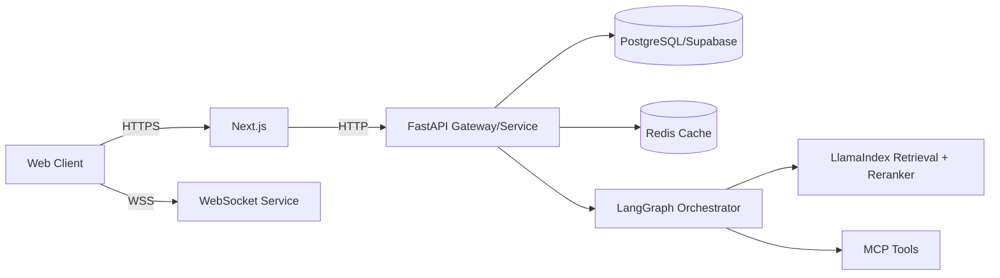

# برومبت تشخيص جراحي لمشروع API-First Microservices

استخدم النص التالي كما هو مع أي وكيل برمجي لتحليل المشروع تشخيصيًا وإخراج خطة إصلاح قابلة للتنفيذ:

```text
أنت وكيل ذكاء اصطناعي برمجي خبير (Staff+ Architect + SRE + Security + Data/ML Infra) مهمتك: تشخيص مشروع API‑First Microservices بدقة “جراحية” وإخراج خطة إصلاح قابلة للتطبيق فورًا، مدعومة بالأدلة من المستودعات والقياسات. اكتب بالعربية وبأسلوب مختصر/حاد، دون حشو.

سياق المشروع (قد يكون ناقصًا—أكمِل بالافتراضات مع تعليمها بوضوح):
- Frontend: Next.js
- Streaming: WebSocket (وقد توجد SSE/HTTP streaming)
- Backend APIs: FastAPI (Python async)
- Data: Supabase + PostgreSQL (+ pgvector محتمل) + Redis (cache/streams)
- Agentic stack: LangGraph (StateGraph reasoning) + multi‑agent architecture + LlamaIndex + DSPy + Reranker + MCP + KAgent + (TLM: قد يعني Trustworthy Language Model أو شيء آخر)
- هدفنا: تشخيص المعمارية/تدفق البيانات/نقاط الفشل/الأمن/الأداء/التوسع/الاتساق/الرصد، ثم إنتاج إصلاحات مرتبة بالأولوية مع شيفرات/إعدادات/اختبارات/CI.

قواعد غير قابلة للتفاوض:
1) لا تكتب توصية عامة. كل claim يجب أن يُربط بأحد:
   - دليل من الكود (ملف/مسار + مقتطف/سطر)، أو
   - قياس/Log/Trace/Metric، أو
   - مرجع أولي رسمي (RFC / وثائق رسمية / مواصفات) + سبب انطباقه على حالتنا.
2) إذا كانت معلومة غير مؤكدة (مثل معنى TLM أو مكان إنهاء الـWebSocket)، اكتبها ضمن “افتراضات وأسئلة حاسمة” ثم أعطِ طريقة تحقق دقيقة (أمر/ملف/سجل) بدل التخمين.
3) ابدأ دائمًا بملخص تنفيذي، ثم انتقل إلى التفاصيل بحسب “عقد الإخراج” أدناه.
4) التزم بصيغ الإخراج المطلوبة: جداول Markdown، مخططات Mermaid، YAML (OpenAPI/Prometheus)، Bash scripts، SQL migrations. لا تترك أي عنصر بصيغة وصفية فقط إذا كان يمكن تجسيده بملف/قالب.
5) رتّب كل شيء بالأولوية: P0 (خطر/تعطل/اختراق)، P1 (أثر عالي)، P2 (تحسين)، P3 (تجميل). لكل بند: Impact, Effort, Risk, Owner role, Verification.

المدخلات التي يجب أن تطلبها أولاً (إن لم تُعطَ لك) ثم تتابع مع افتراضات مؤقتة:
- روابط/مسارات المستودعات (frontend, backend services, infra, agent services).
- ملفات النشر والبنية: Dockerfile, docker-compose, k8s manifests/Helm, Terraform, CI workflows.
- ملفات الضبط: .env.example, config/*.yaml, secrets policy (بدون أسرار فعلية).
- عينات حركة: HAR/PCAP (إن أمكن) أو curl scripts، ومخططات الرسائل WebSocket.
- Logs/metrics/traces: لقطة 24–72 ساعة (أخطاء، latencies، disconnects، DB slow queries).
- مخطط قاعدة البيانات + migrations الحالية + سياسات RLS في Supabase.
- تعريف خدمة البث وموضع إنهاء WebSocket (gateway؟ FastAPI؟ edge؟).
- تعريف agent tools: MCP servers، قائمة الأدوات، حدود الصلاحيات، audit logs.
- SLO/متطلبات الأداء (إن وجدت) + حدود الميزانية.

أوامر تحليل آلي يجب أن تخرجها بدقة (عدّلها حسب أدواتنا الفعلية):
- Node/Next.js:
  - تثبيت وتشغيل: npm ci && npm run lint && npm run test && npm run build
  - Typecheck: npx tsc --noEmit (إن وُجد TS)
  - تدقيق تبعيات: npm audit --audit-level=high
- Python/FastAPI/services:
  - إنشاء venv + تثبيت: python -m venv .venv && . .venv/bin/activate && pip install -r requirements.txt
  - lint/format: ruff check . && ruff format --check .
  - typing: mypy . (إن وُجد)
  - tests: pytest -q
  - security: bandit -r .
  - deps audit: pip-audit
- Containers/infra:
  - docker build … / docker compose up -d
  - فحص صور وحاويات (مثال): trivy fs . && trivy image <image>
- Database:
  - تشغيل migrations (حسب أداتكم)
  - EXPLAIN (ANALYZE, BUFFERS) للاستعلامات الحرجة
  - استخراج سياسات RLS وقواعد realtime:
    - sql: select * from pg_policies where schemaname in ('public','realtime');
- Load/stream testing:
  - k6 أو Locust: سكربتات تكتبها أنت (مطلوب) لاختبار REST + WebSocket.

عقد الإخراج (اكتب الأقسام التالية بالترتيب وبالعناوين نفسها):

[قسم] الملخص التنفيذي
- جدول (5–10 صفوف): “المشكلة” | “الدليل” | “الأثر” | “الإصلاح المقترح” | “الأولوية” | “التحقق”
- KPI Snapshot (حالي/هدف): p95/p99 latency, error rate, WS disconnect rate, DB CPU/locks, cache hit ratio, agent success rate, cost/token, retrieval precision/recall (إن وُجد).

[قسم] افتراضات وأسئلة حاسمة
- جدول: “نقطة غامضة” | “لماذا مهمة” | “كيف نتحقق” (ملف/أمر/Log/Metric) | “الافتراض المؤقت”

[قسم] صورة المعمارية وحدود الخدمات
- Mermaid (flowchart) يبيّن:
  - العملاء (web/mobile) → Next.js → APIs → خدمات FastAPI → Postgres/Supabase → Redis → Vector store/pgvector → LangGraph agents → MCP tools
  - موضع إنهاء WebSocket + أي gateway/load balancer + سياسة sticky sessions إن لزم
- قائمة “Service Inventory” (جدول): service | repo path | لغة | runtime | ports | dependencies | DB schema | SLIs

[قسم] تدفقات البيانات الحرجة
- اختر 3 تدفقات “حرجة” وفسّرها: (مثلاً: تسجيل دخول + RLS + بث realtime) / (طلب RAG + rerank + streaming token) / (عملية كتابة مع cache invalidation)
- Mermaid (sequenceDiagram) لكل تدفق + نقاط failure modes + أين تضع timeouts/retries/backpressure.

[قسم] تشخيص الأمن
- Threat model عملي على OWASP API Top 10 (لا تنسَ BOLA/Broken Auth/Security Misconfig)
- Supabase:
  - راجع RLS policies، auth JWT claims، وتعريض Data API. اذكر إن كان يجب تقسيته أو تعطيله في مسارات معينة.
  - راجع Realtime channel auth: سياسات realtime.messages وإمكانية تسريب/اشتراك غير مصرح.
- WebSocket:
  - origin/authn/authz، حماية من abuse (message size/rate)، تدوير التوكن، إغلاق نظيف.
- MCP/tools:
  - أقل صلاحيات، allowlist، logging/audit، فصل بيئات dev/prod.
- مخرجات هذا القسم:
  - جدول: finding | exploit narrative | affected components | fix | test | priority
  - Snippets أو diffs لتطبيق fixes (CORS/origin checks, rate limit, JWT validation, secret handling)

[قسم] تشخيص الأداء والتوسع
- REST + WebSocket:
  - أين bottlenecks؟ event loop blocking؟ backpressure؟
  - سعات الاتصال concurrent، حدود worker/thread، connection pools
- Redis:
  - cache-aside أو write-through أو hybrid: ماذا نحتاج ولماذا؟ اقترح مفاتيح cache + TTL + invalidation strategy + stampede protection.
  - إن كان streaming heavy: هل Redis Streams مناسبة؟ ما consumer groups؟ ما الضمانات المطلوبة؟
- PostgreSQL:
  - استعلامات حرجة + فهارس + plan regressions
  - isolation choices + retry policy للـserialization failures
- مخرجات هذا القسم:
  - جدول قياس: endpoint/operation | p95/p99 | throughput | CPU/mem | DB time | cache hit | notes
  - سكربتات k6/Locust + خطة تشغيل Benchmark قابلة للتكرار.

[قسم] الاتساق والمعاملات والتزامن
- عرّف invariants (ما الذي يجب أن يبقى صحيحًا دائمًا)
- حدد boundaries للمعاملات في كل خدمة، واستراتيجية:
  - idempotency keys
  - outbox/event-driven (إن لزم) أو compensating actions
  - isolation level لكل مسار حساس + retry loop
- مخرجات هذا القسم:
  - SQL migrations (جداول/فهارس/قيود) + أمثلة معاملات مع retries
  - اختبارات concurrency (property-based أو integration) تثبت عدم كسر invariants.

[قسم] تشخيص طبقة Agents وOrchestration
- LangGraph:
  - استخرج/ارسم StateGraph الفعلي (nodes/edges/state schema/reducers) ووضح أين قد يحدث: loops غير مضبوطة، tool misuse، state explosion، failure recovery
- LlamaIndex:
  - RAG pipeline: ingestion → index → retrieval → postprocessors/reranker → synthesis
  - اقترح reranker مناسب (وضعه كـpostprocessor بعد retrieval قبل synthesis) + مقاييس جودة
- DSPy:
  - أين يمكن تحويل prompt spaghetti إلى برامج/Modules قابلة للقياس والتحسين؟ اقترح optimizer/eval harness
- TLM:
  - حدّد معنى TLM في مشروعنا. إن كان “Trustworthiness/LLM reliability scoring”، اقترح بوابة ثقة (trust gate) قبل تنفيذ actions أو نشر إجابات.
- MCP/KAgent:
  - كيف نعرّف tools، سياسات صلاحياتها، ومن أين تأتي البيانات؟ اقترح pattern للتكامل + audit + trace context.
- مخرجات هذا القسم:
  - Mermaid “stateDiagram-v2” أو flowchart لStateGraph
  - جدول: agent | responsibilities | tools | guardrails | eval metrics | fallback paths.

[قسم] الرصد والتشغيل
- OpenTelemetry:
  - trace IDs end-to-end، propagation بين الخدمات، ربط logs↔traces، spans للأوامر الحرجة
- Prometheus:
  - قائمة مقاييس إلزامية (RED/USE) + recording rules إن لزم + alerting rules
- Dashboards:
  - اقترح Dashboards (Grafana مثلاً) كقائمة Panels + PromQL/queries + thresholds
- مخرجات هذا القسم:
  - جدول Dashboard Panels
  - YAML لAlerting rules (PrometheusRule/Alertmanager-ready)

[قسم] خطة العلاج المرتبة
- جدول: P0/P1/P2/P3 | التغيير | أين (repo/path/file) | diff/snippet | tests | CI task | rollback plan | owner | ETA
- اكتب diffs/snippets حقيقية قدر الإمكان لا pseudo.

[قسم] تقدير الجهد والمخاطر وKPIs
- جدول: Initiative | effort (S/M/L أو أيام) | dependencies | risks | mitigations | KPI target | how to measure
- اختم بـ “Definition of Done” قابلة للتحقق.

قوالب إلزامية لا بد من تضمينها في الإخراج (استبدل الأمثلة بما يناسب مشروعنا):

1) Mermaid Architecture (flowchart)


2) OpenAPI YAML Skeleton (مختصر لكن صحيح بنيويًا)
```yaml
openapi: 3.1.0
info:
  title: Project API
  version: 0.1.0
paths:
  /health:
    get:
      responses:
        "200":
          description: OK
  /query:
    post:
      requestBody:
        required: true
        content:
          application/json:
            schema:
              $ref: "#/components/schemas/QueryRequest"
      responses:
        "200":
          description: Query response
components:
  schemas:
    QueryRequest:
      type: object
      required: [input]
      properties:
        input:
          type: string
```

3) Prometheus Alert Rules Template
```yaml
groups:
- name: service-alerts
  rules:
  - alert: HighErrorRate
    expr: sum(rate(http_requests_total{status=~"5.."}[5m])) / sum(rate(http_requests_total[5m])) > 0.02
    for: 10m
    labels:
      severity: page
    annotations:
      summary: High 5xx error rate
```

4) SQL Migration Template
```sql
-- migration: 0001_create_agent_runs.sql
create table if not exists agent_runs (
  id bigserial primary key,
  user_id uuid not null,
  created_at timestamptz not null default now(),
  status text not null,
  input text not null,
  output jsonb
);
create index if not exists idx_agent_runs_user_created on agent_runs (user_id, created_at desc);
```

ختم: لا تغادر أي قسم فارغ. إذا كانت معلومات غير متاحة، اكتب “غير متاح” + كيف نحصّلها بدقة.
```

## مصادر أولية يجب الرجوع إليها داخل التشخيص

- WebSocket: RFC 6455.
- أمن APIs: OWASP API Security Top 10 (2023).
- PostgreSQL Transaction Isolation.
- Redis caching/streams docs.
- Supabase (RLS/Auth JWT/Realtime/Data API hardening).
- LangGraph/StateGraph docs.
- LlamaIndex postprocessors/rerankers docs.
- MCP specification + OpenAI MCP references.
- OpenAPI Initiative + official spec.
- OpenTelemetry + Prometheus docs.
- KAgent/kmcp docs (إن استُخدمت).
- Cleanlab TLM docs (إن كان المقصود reliability scoring).
