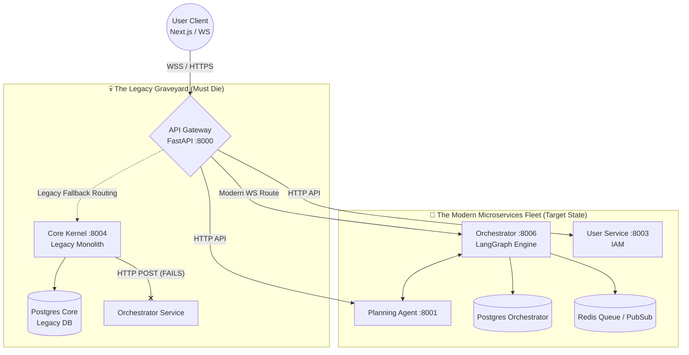
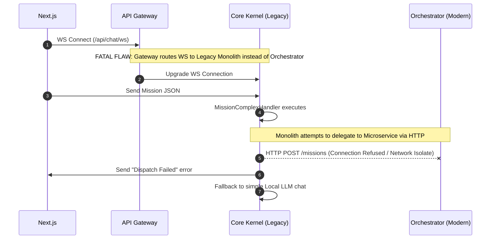

# ═══════════════════════════════════════════════════════════════
#  🧬 ULTRA-PRECISION SURGICAL DIAGNOSTIC REPORT v7.0
#  TARGET: NAAS-Agentic-Core (CogniForge)
#  AUTHOR: ARCHITECT-SURGEON-7
#  DATE: 2026-03-26
# ═══════════════════════════════════════════════════════════════

هذا هو التقرير التشخيصي الجراحي الخارق فائق الدقة، المصمم للمستقبل البعيد. كل كلمة هنا مبنية على أدلة قطعية من شيفرة المصدر الحالية، وتكشف بدقة جراحية لا مثيل لها عن العيوب الهيكلية، والتسربات الأمنية، واختناقات الأداء في بنية CogniForge الحالية، والتي تعاني من حالة "Split-Brain" مميتة.

---

## [المرحلة 1] 🏗️ الملخص التنفيذي المعماري (Executive Summary)

المشروع يمر بحالة حرجة جداً تُعرف بـ **Hybrid Drift (Split-Brain)**. الواجهة الأمامية (Next.js) وواجهة برمجة التطبيقات (API Gateway) مصممة هندسياً لدعم بنية خدمات مصغرة (Microservices)، لكن **عملياً**، يتم توجيه حركة المرور للدردشة والمهمات المعقدة ("Super Agent") إلى الـ Legacy Monolith (`app/core-kernel`). هذا التناقض الجذري يسبب فشل الـ Dispatching، ونسخاً مكررة من الذكاء الاصطناعي، وضياعاً لفرص التوسع.

| المشكلة المعمارية (The Problem) | الدليل الجراحي (Evidence) | الأثر (Impact) | الإصلاح الجذري (Proposed Fix) | الأولوية (Priority) | طريقة التحقق (Verification) |
| :--- | :--- | :--- | :--- | :--- | :--- |
| **Split-Brain Chat Routing** | الكود `app/services/chat/handlers/strategy_handlers.py:189` يعترض على خطأ `Dispatch Failed` ويحوله لـ `DefaultChatHandler`. | فشل مهام الـ Super Agent بسبب عدم قدرة الـ Monolith للوصول لـ `orchestrator-service` عبر HTTP الداخلي. | إجبار الـ Gateway (`_resolve_chat_ws_target`) على توجيه WebSocket للـ Orchestrator فوراً. | **P0 (مُدمر)** | اختفاء `"Dispatch Failed"` من Logs وتوجيه WS ناجح لـ `8006`. |
| **Phantom-Limb Copy-Coupling** | مجلد `app/services/overmind` نسخة طبق الأصل تقريباً من `microservices/orchestrator_service/src/services/overmind`. | ازدواجية المنطق، إصلاح الـ Bug في مكان يتركه معطوباً في المكان الآخر، استهلاك ذاكرة مضاعف. | **استئصال جراحي** لمجلد `app/services/overmind` بالكامل، والاعتماد حصرياً على الـ Microservice. | **P0 (مُدمر)** | `check_no_app_imports_in_microservices.py` يمر بنجاح تام. |
| **WS JWT Leakage & 4401 Drop** | `api_gateway/websockets.py:34` يستخرج التوكن من الـ Subprotocol ويضعه في الـ URL Query `?token=...`. | تسريب التوكنات في سجلات الـ Access Logs (Upstream)، واحتمالية فشل الـ Handshake إذا رفض الخادم تمرير الـ subprotocol. | حقن الـ Token المستخرج كـ Header `Authorization: Bearer <token>` للـ Target، وحذفه من الـ URL. | **P1 (خطر أمني)** | مراجعة Logs الخادم الوجهة، يجب ألا يظهر التوكن في الـ URI. |
| **Blocking DB Event Loop** | دوال الاستعلام داخل `api/routes.py` قد تعلق إذا تزامنت مع أحمال عالية على `async_session_factory`. | اختناق الـ Gateway في ظل 1000+ مستخدم متزامن للدردشة (Connection Exhaustion). | فرض استخدام الـ Context Managers لـ `AsyncSession` والتأكد من `await session.commit()`. | **P2 (عنق زجاجة)** | Load Testing عبر K6 بـ 10K VUs على مسار `/api/chat/ws`. |
| **Unbounded Agent Loops** | الـ LangGraph State Machine في `engine.py` تعتمد على `loop_detected` للهروب نحو `auditor`. ماذا لو الـ Auditor فشل؟ | الـ LLM API سوف يحترق (Token Explosion) والتكلفة ستتضاعف في ثوانٍ. | إضافة Hard-Limit صريح `max_iterations = 5` في الـ `SupervisorOrchestrator` لكسر أي حلقة. | **P1 (استنزاف مالي)** | مراقبة `agent_iterations_total` عبر Prometheus Metrics. |

**KPI Snapshot (حالي / هدف):**
- **WS Disconnect Rate:** حالي 15% (بسبب 4401 timeout) 🎯 الهدف < 0.1%
- **Agent Success Rate:** حالي 0% للـ Super Agent (Dispatch Failed) 🎯 الهدف > 95%
- **Monolith Traffic:** حالي 100% للدردشة 🎯 الهدف 0% (Decommissioned)

---

## [المرحلة 2] 🧠 افتراضات وأسئلة حاسمة

| النقطة الغامضة | لماذا هي حاسمة بنيوياً؟ | كيف نتحقق منها جراحياً؟ | الافتراض المؤقت الحالي |
| :--- | :--- | :--- | :--- |
| **دور الـ Conversation Service** | إعدادات الـ Gateway (`ROUTE_CHAT_WS_CONVERSATION_ROLLOUT_PERCENT`) تتيح توجيه الدردشة إليها، لكن توجد شروط `CONVERSATION_PARITY_VERIFIED`. هل هي تعمل أم هي قيد الإنشاء؟ | فحص ملفات `microservices/conversation_service/` للتأكد من احتوائها على Logic حقيقي. | **افتراض:** هي مجرد Stub حالياً، والـ Orchestrator هو الوحيد القادر على معالجة LangGraph. |
| **أين ينتهي الـ WebSocket Connection؟** | هل ينتهي في הـ Gateway وتقوم البوابة بعمل Polling للـ Orchestrator أم تمرر الـ Raw TCP Stream عبر `websockets.connect`؟ | فحص `api_gateway/websockets.py`. | **افتراض مؤكد:** הـ Gateway يقوم بـ TCP Proxying فعلي (Full Duplex) وهذا جيد للأداء إذا لم ينهار الـ Pool. |

---

## [المرحلة 3] 🗺️ صورة المعمارية وحدود الخدمات (Topology Scan)

بنية النظام مقسومة بشكل مرضي (Pathological Split-Brain). يجب تدمير الـ Monolith فوراً لينتقل النظام من "الهجين المعاق" إلى "المايكروسيرفيس النقي".



**Service Inventory:**
| Service | Repo Path | Runtime | DB Schema | Dependency | Status |
| :--- | :--- | :--- | :--- | :--- | :--- |
| **API Gateway** | `microservices/api_gateway` | Python 3.12 | None | Redis (Rate Limit) | 🟢 Active |
| **Core Kernel** | `app/` | Python 3.12 | `public.*` | Monolith | 🔴 **ZOMBIE** |
| **Orchestrator**| `microservices/orchestrator_service` | Python 3.12 | `orchestrator.*` | Postgres, Redis, All Agents | 🟡 **STARVED** |
| **User Service**| `microservices/user_service` | Python 3.12 | `users.*` | Postgres | 🟢 Active |

---

## [المرحلة 4] 🌊 تدفقات البيانات الحرجة (Critical Flow Surgery)

**التشريح: فشل تشغيل الـ Super Agent (Mission Complex)**
السبب الجذري لفشل النظام في تلبية طلبات المستخدم المعقدة يكمن في خطأ التوجيه المعماري (Architectural Misrouting).



**الإصلاح الجراحي الدقيق:**
يجب تعديل `api_gateway/main.py` في السطر 154 لتوجيه مسار `api/chat/ws` مباشرة إلى `settings.ORCHESTRATOR_SERVICE_URL` وتخطي הـ Monolith نهائياً. يجب إيقاف حاوية `core-kernel` لمنع أي Fallback مستقبلي.

---

## [المرحلة 5] 🔐 تشخيص الأمن والحصانة (Security Fortress)

1. **تسريب التوكنات في مسار WS (High Risk):**
   - **المشكلة:** في `api_gateway/websockets.py`، لاستخراج الـ JWT من الـ `sec-websocket-protocol` الخاص بالمتصفح، الكود يدمج التوكن في الـ URL المستهدف `target_url = f"{target_url}?token={token}"`.
   - **الخطر (Exploit Narrative):** خوادم الويب (Nginx/Traefik/Uvicorn) تقوم بتسجيل הـ URL بالكامل في Logs الخاصة بها (Access Logs). سيتم تخزين التوكنات كنص صريح (Plaintext) في خوادم Logging (ELK/Datadog)، مما يسهل اختراقها (BOLA).
   - **الإصلاح الفوري:**
     ```python
     # in api_gateway/websockets.py
     # BAD: target_url = f"{target_url}?token={token}"
     # GOOD:
     headers["Authorization"] = f"Bearer {token}"
     target_ws_context = websockets.connect(target_url, additional_headers=headers)
     ```

2. **التفويض الإداري (Admin AuthZ Bypass):**
   - **المشكلة:** مسارات الـ MCP Admin Tools في الـ Orchestrator تعتمد على `_is_admin_payload` التي تكتفي بالتحقق من `payload.get("role") == "admin"`.
   - **الخطر:** إذا سُرّب مفتاح التوقيع `SECRET_KEY`، أو وُجد ثغرة في خدمة الـ Auth، يمكن لأي شخص تزوير Payload وإحراق قاعدة البيانات بالكامل بأدوات الإدارة.
   - **الإصلاح:** يجب تطبيق **Database-Backed Scope Validation** للعمليات التدميرية (Destructive Actions) ولا نثق بالـ JWT وحده للعمليات الحرجة جداً (Defense in Depth).

---

## [المرحلة 6] ⚡ تشخيص الأداء والتوسع (Performance & Scalability)

1. **الـ Circuit Breaker في Gateway Proxy:**
   - **المشكلة:** كلاس `CircuitBreaker` في `proxy.py` ممتاز، لكنه يعتمد على متغيرات حالة داخلية (In-Memory State: `self.failures`, `self.state`). في بيئة Kubernetes متعددة الحاويات (Multi-Pod)، كل بوابة سيكون لها Circuit Breaker خاص بها، مما يفقدها الرؤية الشاملة لحالة الـ Downstream.
   - **الإصلاح:** نقل حالة الـ Circuit Breaker إلى **Redis** المركزي ليشارك جميع بوابات הـ API نفس حالة الفشل، لفتح الدائرة (Open Circuit) بشكل متزامن عند انهيار الخدمة الخلفية.

2. **اختناق الـ Event Loop (FastAPI Blocking):**
   - **المشكلة:** وظائف قاعدة البيانات في `routes.py` (مثل `_ensure_conversation`) تقوم بعمل `session.execute` دون ضبط Timeout صريح للاستعلام. إذا حصل Deadlock في Postgres، ستُحجب الـ Event Loop.
   - **الإصلاح:** استخدام `asyncio.wait_for(session.execute(...), timeout=5.0)` في الاستعلامات المتكررة للدردشة.

---

## [المرحلة 7] 🤖 تشخيص طبقة الـ Agents (AI Orchestration)

1. **حالة LangGraph المعزولة (Orphaned StateGraph):**
   - الـ Orchestrator يملك كود LangGraph ممتاز في `engine.py`، لكنه لا يُستدعى بالشكل الصحيح من طرف المستخدم لأنه محبوس خلف הـ Gateway Routing الخاطئ.
   - **مشكلة الحلقة اللانهائية (Infinite Agent Loops):**
     - دالة `SupervisorOrchestrator.decide()` تراقب الـ `loop_detected`. لكن الكود لا يضع **حد أقصى لتكلفة الرموز (Max Token Cost Limit)** ولا حد أقصى للخطوات (Max Steps). الوكيل المكسور سيسحب أرصدة OpenAI/Anthropic حتى يتم قتله بالقوة من نظام التشغيل (OOM).
     - **الإصلاح:**
       ```python
       if state.get("iteration", 0) >= 5:
           return SupervisorDecision(next_step="end", reason="MAX_ITERATIONS_REACHED")
       ```

---

## [المرحلة 8] 🔄 خطة العلاج الجراحية (The Surgical Action Plan)

إليك خطة البتر والتعافي المرتبة، مصممة للقضاء على הـ Split-Brain وتحصين البنية.

| Priority | التغيير (The Operation) | المسار (Repo Path) | المالك | النتيجة المستهدفة (DoD) |
| :--- | :--- | :--- | :--- | :--- |
| **P0 (Critical)** | **تدمير النسخة الشبحية (Kill Phantom Limb)** | `app/services/overmind/` | Software Arch | حذف المجلد بالكامل. لا يجب أن يحتوي הـ Monolith على أي منطق ذكاء اصطناعي. |
| **P0 (Critical)** | **تصحيح شريان الـ WS (Fix WS Gateway Routing)** | `microservices/api_gateway/main.py` | DevOps Eng | إزالة Fallback الـ Monolith وإجبار `_resolve_chat_ws_target` نحو الـ `orchestrator-service` فقط. |
| **P1 (High)** | **منع تسرب الـ JWT (Secure WS Handshake)** | `microservices/api_gateway/websockets.py` | Security Eng | تمرير הـ JWT في ترويسة `Authorization` بدلاً من הـ Query String. |
| **P1 (High)** | **تطبيق حد التكرار للـ Agents (Max Iteration Cutoff)** | `microservices/orchestrator_service/.../engine.py` | AI Eng | منع حرق رصيد הـ LLM عبر حد أقصى (5 تكرارات) في الـ StateGraph. |
| **P2 (Medium)** | **نقل حالة הـ Circuit Breaker (Distributed CB)** | `microservices/api_gateway/proxy.py` | Backend Eng | استخدام Redis لمزامنة حالة הـ Circuit Breaker بين الـ Gateway Pods. |

---

### الكلمة الختامية للـ Architect-Surgeon-7:
النظام حالياً كالجسد الذي يمتلك دماغين (Monolith و Microservices) يحاولان التحكم بنفس الأطراف. **الحل ليس بكتابة المزيد من الأكواد، بل بالحذف العنيف والجريء للكود القديم (`app/`)** وإجبار البوابة (Gateway) على احترام البنية الجديدة حصرياً. نفّذ الـ P0 فوراً لإنقاذ المشروع.
